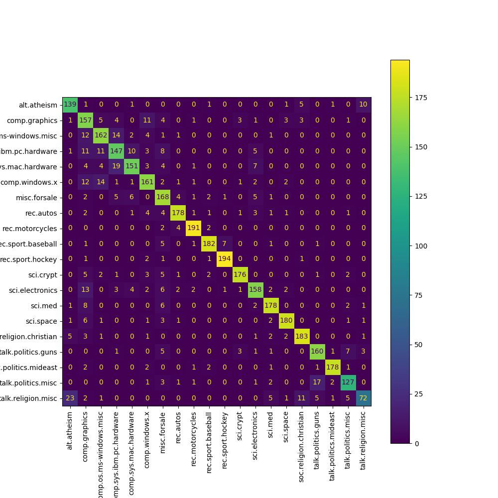

# Machine Learning Report Toolkit

Generating evaluating metrics reports for machine learning models in two lines of code.

```python
from ml_report import MLReport

report = MLReport(y_true_label, y_pred_label, y_pred_prob, class_names)
report.run(results_path="results")
```

This will generate a classifier report, containing the following information:

- A classification report with precision, recall and F1.
- A visualization of the precision and recall curves as a function of the threshold for each class.
- A confusion matrix.
- A `.csv` file with precision, recall, at different thresholds.
- A `.csv` file with predictions scores for each class for each sample.

All this information is saved in the `results` folder under different filenames, containing both
images, `.csv` files, and a `.txt` file with the classification report.

<p float="left">
  
  
</p>

```
                          precision    recall  f1-score   support

             alt.atheism       0.81      0.87      0.84       159
           comp.graphics       0.65      0.81      0.72       194
 comp.os.ms-windows.misc       0.81      0.82      0.81       197
comp.sys.ibm.pc.hardware       0.75      0.75      0.75       196
   comp.sys.mac.hardware       0.86      0.78      0.82       193
          comp.windows.x       0.81      0.81      0.81       198
            misc.forsale       0.74      0.86      0.80       195
               rec.autos       0.92      0.90      0.91       198
         rec.motorcycles       0.95      0.96      0.95       199
      rec.sport.baseball       0.94      0.92      0.93       198
        rec.sport.hockey       0.96      0.97      0.96       200
               sci.crypt       0.95      0.89      0.92       198
         sci.electronics       0.85      0.81      0.83       196
                 sci.med       0.90      0.90      0.90       198
               sci.space       0.94      0.91      0.93       197
  soc.religion.christian       0.90      0.92      0.91       199
      talk.politics.guns       0.86      0.88      0.87       182
   talk.politics.mideast       0.97      0.95      0.96       188
      talk.politics.misc       0.86      0.82      0.84       155
      talk.religion.misc       0.82      0.57      0.67       126

                accuracy                           0.86      3766
               macro avg       0.86      0.86      0.86      3766
            weighted avg       0.86      0.86      0.86      3766
```

## Example: running ML-Report-Toolkit on cross-fold classification

Install the package and dependencies:

```bash
pip install ml-report-kit
pip install scikit-learn
```

Run the following code:

```python
    
from sklearn.datasets import fetch_20newsgroups
from sklearn.model_selection import StratifiedKFold
from sklearn.pipeline import Pipeline
from sklearn.feature_extraction.text import TfidfVectorizer
from sklearn.linear_model import LogisticRegression

from ml_report import MLReport

dataset = fetch_20newsgroups(subset='all', shuffle=True, random_state=42)
k_folds = StratifiedKFold(n_splits=3, shuffle=True, random_state=42)
folds = {}

for fold_nr, (train_index, test_index) in enumerate(k_folds.split(dataset.data, dataset.target)):
    x_train, x_test = np.array(dataset.data)[train_index], np.array(dataset.data)[test_index]
    y_train, y_test = np.array(dataset.target)[train_index], np.array(dataset.target)[test_index]
    folds[fold_nr] = {"x_train": x_train, "x_test": x_test, "y_train": y_train, "y_test": y_test}

for fold_nr in folds.keys():
    clf = Pipeline([('tfidf', TfidfVectorizer()), ('clf', LogisticRegression(class_weight='balanced'))])
    clf.fit(folds[fold_nr]["x_train"], folds[fold_nr]["y_train"])
    y_pred = clf.predict(folds[fold_nr]["x_test"])
    y_pred_prob = clf.predict_proba(folds[fold_nr]["x_test"])
    y_true_label = [dataset.target_names[sample] for sample in folds[fold_nr]["y_test"]]
    y_pred_label = [dataset.target_names[sample] for sample in y_pred]
    
    report = MLReport(y_true_label, y_pred_label, y_pred_prob, dataset.target_names)
    report.generate_report()
```

This will generate, for each fold, the reports and metrics mentioned above, in the `reports` folder.

## License

Apache License 2.0
